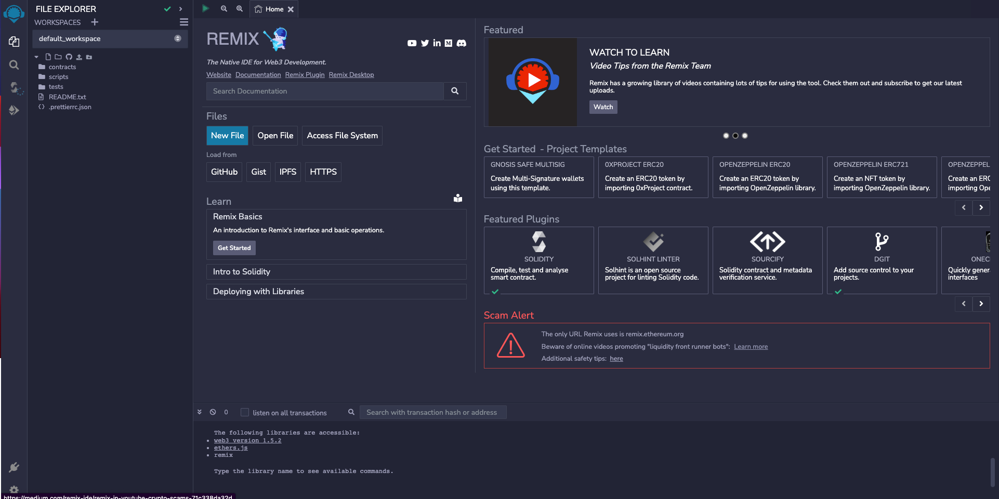

# How to Build a Car Marketplace dapp using React

## Introduction
Celo blockchain enables fast, secure, and low-cost financial transactions. It is built on top of the Ethereum Virtual Machine (EVM), which is a standardized environment for running smart contracts (self-executing code that can be used to facilitate, verify, and enforce the negotiation or performance of a contract). 
One of the main features of Celo is its use of proof-of-stake (PoS) consensus, which means that the network is secured by a group of "validators" who stake (or pledge) a certain amount of the platform's native cryptocurrency  in order to participate in the validation of transactions. 

## Prerequisites
This tutorials exposes you to how building a simple fullstack dapp (decentralized application) using react. You will need to have familiarity of the following:

- Prior knowledge of HTML and CSS
- Basic understanding of blockchain concepts
- Have some knowledge on solidity and its concepts

## Requirements
- **[NodeJS](https://nodejs.org/en/download)** from V12.or higher
- A code editor or text editor. **[VSCode](https://code.visualstudio.com/download)** is recommended
- A terminal. **[Git Bash](https://git-scm.com/downloads)** is recommended
- An Internet Browser and good internet connection
- **[Remix](https://remix.ethereum.org)**
- **[Celo Extension Wallet](https://chrome.google.com/webstore/detail/celoextensionwallet/kkilomkmpmkbdnfelcpgckmpcaemjcdh?hl=en)**.

## Let's Begin

Below are screenshots of what our dapp would look like


_This tutorial is targeted at total beginners with basic prior knowledge of HTML and CSS. _

## Smart Contract Development

We will start by building our `Gymnaseum.sol` contract first using Remix. Remix is a web based IDE that allows developers to write, test and deploy smart contracts on the Celo blockchain. 

Here is a preview of the Remix IDE:


On Remix, We would create a new workspace and then a new file which we will call 'Gymnaseum.sol'.


Starting out in the first line, you include a statement that specifies the license under which the code is being released.

```js
// SPDX-License-Identifier: MIT
pragma solidity >=0.7.0 <0.9.0;
```

This license governs how the code can be used, and it is important to ensure that the correct license is used to avoid any legal issues. A resource such as SPDX can be used to help identify a suitable license.

To ensure the smart contract can run without any issues and is protected by a license, it's important to indicate the version of the compiler and the license it uses. This can be done by specifying the compiler version with the `pragma` keyword, and the license used, by including a statement that specifies the license at the beginning of the contract code.


Next, we import the Service Contract which we will also be used in this project `import './GymnaseumService.sol';` the service contract has the hire function to hire a gym trainer and pay with the celo stablecoin (cUSD). 

```js
// SPDX-License-Identifier: MIT

pragma solidity >=0.7.0 <0.9.0;
import './GymnaseumService.sol';
```

Next up, we define an IERC20Token interface which enables us to interact with the celo stablecoin (cUSD).


```js
interface IERC20Token {
  function transfer(address, uint256) external returns (bool);
  function approve(address, uint256) external returns (bool);
  function transferFrom(address, address, uint256) external returns (bool);
  function totalSupply() external view returns (uint256);
  function balanceOf(address) external view returns (uint256);
  function allowance(address, address) external view returns (uint256);

  event Transfer(address indexed from, address indexed to, uint256 value);
  event Approval(address indexed owner, address indexed spender, uint256 value);
}
```

ERC-20 tokens are a widely-used standard for creating digital assets on the Ethereum blockchain, and cUSD is one of them.

These tokens have pre-defined functions and events that can be easily used in contracts, and do not require any additional implementation. For example, you will be using the ERC-20 token's interface to interact with it, so that your contract can communicate with the token.

You can find more information on how to use these functions and events in the Celo **[documentation](https://docs.celo.org/developer-guide/celo-for-eth-devs)**. The documentation also provides more details on how to interact with ERC-20 tokens and how to use them with the Celo network.

Following this, You define your smart contract by giving it a name. In our case our contract name is `Gymnaseum`. You can name it anything you want but ensure you keep it descriptive.

```js
Contract Gymnaseum {

  struct Product {
    address payable owner;
    string name;
    string image;
    string description;
    string location;
    uint serviceFee;
    uint price;
    uint sold;
  }
}
  ...
```
After defining the single variables used in the contract, you want to give the product its properties and group variables together.

To do this, you would require a struct data type with the keyword `struct` and give it multiple properties. ([Learn about structs here](https://docs.soliditylang.org/en/latest/types.html#structs))

For this tutorial, these would be the variables that you would store in the struct:
1. owner - This would store the address of the owner of a particular Product as all products in the marketplace has an owner. This has the address data type.
2. name - This stores the name of the product. This has a String data type.
3. image - This stores the image of the product gotten from a URL and it has a string data type.
4. description - This stores the project description and also has a string data type.
5. location - This stores the location of the product and also has a string data type.
6. serviceFee - This stores the gas fee to buy a product. Its a number so it has a type of uint.
6. price - This stores the amount of the product. Its also a number so it has a type of uint.
7. sold - This keeps track of when a product is sold or not and it has a type of Boolean.


In the next line, you define a state variable productsLength, this is going to keep track of the products in our contract. It is of a `uint` type which means it can only store integer values. [(Learn more about data types in solidity)](https://docs.soliditylang.org/en/latest/types.html)

```js
uint internal productsLength = 0;
```
We also define the visibility of our variable to `internal` which means it cannot be accessed from external smart contracts or addresses and can only be modified within the smart contract. ([Learn more about visiblity](https://docs.soliditylang.org/en/latest/contracts.html#visibility-and-getters)). Also, for us to interact with the cUSD ERC-20 token on the Celo alfajores test network, you need to know the address of the token. So we define this also with the code below:

```js
  address payable internal onwerAddress;
  ServiceInterface internal ServiceContract;  
```
In the code above we also interfaced the Service Contract.
The purpose of an interface is to enforce a defined set of properties and to execute specific functions in another object.([Learn more about Interfaces in Solidity Smart Contracts](https://cryptomarketpool.com/interface-in-solidity-smart-contracts/)).

Next in our smartcontract is a mapping function to handle multiple products, a mapping is needed where you can access the value of a product through their key. 
To create a mapping, you use the keyword `mapping` and assign a key type to a value type. In this case, your key would be an integer and the value would be the struct Product we just created.

```js
  mapping (uint => Product) internal products;
```

As stated earlier, for us to interact with the cUSD ERC-20 token on the Celo alfajores test network, you need to know the address of the token. Which we are doing in the code below:

```js
  address internal cUsdTokenAddress = 0x874069Fa1Eb16D44d622F2e0Ca25eeA172369bC1;
```

We also define a constructor in the code below. The msg.sender function returns the address of the entity that initiated the call and is capable of receiving payments. This address will be stored as the owner's address.
The ServiceContract function is assigned to the ServiceInterface.

```js
constructor(address serviceContractAddress) {
    onwerAddress = payable(msg.sender);
    ServiceContract = ServiceInterface(address(serviceContractAddress));
  }
```

So far, we have our code as show below:

```js
// SPDX-License-Identifier: MIT

pragma solidity >=0.7.0 <0.9.0;

import './GymnaseumService.sol';


contract Gymnaseum {

  struct Product {
    address payable owner;
    string name;
    string image;
    string description;
    string location;
    uint serviceFee;
    uint price;
    uint sold;
  }

  uint internal productsLength = 0;
  address payable internal onwerAddress;
  ServiceInterface internal ServiceContract;
  mapping (uint => Product) internal products;
  address internal cUsdTokenAddress = 0x874069Fa1Eb16D44d622F2e0Ca25eeA172369bC1;

  constructor(address serviceContractAddress) {
    onwerAddress = payable(msg.sender);
    ServiceContract = ServiceInterface(address(serviceContractAddress));
  }
}
```
In the next section, you will define a function to add the products to the smart contract.

```js
   function writeProduct(
    string memory _name,
    string memory _image,
    string memory _description, 
    string memory _location,
    uint _serviceFee,
    uint _price
  ) public {
    uint _sold = 0;
    products[productsLength] = Product(
      payable(msg.sender),
      _name,
      _image,
      _description,
      _location,
      _serviceFee,
      _price,
      _sold
    );
    productsLength++;
  }
```

You have to specify the parameters type in the function. In this case, we need to pass the name, description, image, location, price and serviceFee (all with an underscore to differentiate them from the struct values) as parameters to the function. 

Next, associate the key productsLength with a new Product structure in the products mapping.

The msg.sender function as discussed earlier returns the address of the entity that initiated the call and is capable of receiving payments. This address will be stored as the owner's address.
You also need to assign values to the other variables using the provided parameters.


Next, we would create a function that would add the service to the ServiceContract.
```js
    function addService(
    string memory _name,
    string memory _image,
    string memory _description, 
    string memory _location,
    string memory _contact,
    uint _rate
  ) public {
    ServiceContract.writeService(_name, _image, _description, _location, _contact, _rate);
  }
```

Next, we would create a function that would read the products created in the 'writeProduct' function.

```js
   function readProduct(uint _index) public view returns (
    address payable owner,
    string memory name, 
    string memory image, 
    string memory description, 
    string memory location, 
    uint serviceFee,
    uint price, 
    uint sold
  ) {
    Product storage product = products[_index];
    return(
      product.owner,
      product.name,
      product.image,
      product.description,
      product.location,
      product.serviceFee,
      product.price,
      product.sold
    );
  }
```

This function will carry a parameter of _index. You also need to specify the variables you will return with the function. 

In this case, it would be a tuple corresponding to the variables declared in the struct. 

The function needs to return the address of the owner, the strings and the uint values of `serviceFee`, `price`, and `sold`.


Proceeding, we would create a function that gets the Service added to the Service contract. 

```js
   function getService(uint _index) public view returns(
    address user,
    string memory name, 
    string memory image, 
    string memory description, 
    string memory location, 
    string memory contact,
    uint rate,
    uint hiresLength
  ) {
    return ServiceContract.readService(_index);
  }
```

The "getService" function, which is public, takes in an index of type uint as a parameter.


The first parameter is the address of the user, the following parameters are the strings and the uint values of `rate`, and `hiresLength`.

The `hiresLength`parameter tracks when a service is hired already.

Next we will call a function to get Service Hire in the block of code below:
```js
   function hireService(
   uint _index,
   uint _price,
   address _serviceUser
  ) public {
    require(
      IERC20Token(cUsdTokenAddress).transferFrom(
        msg.sender,
        payable(_serviceUser),
        _price
      ),
      "Failed to hire this service."
    );

    ServiceContract.hireService(_index);
  }
```


The `hireService` function is a public function because we need it to be accessed outside the contract. The function accepts three arguments: `_index`, `_price`, and `_serviceUser`, which are of type `uint` and `address`.

The function first checks a condition using the `require` statement, which verifies if a transfer of `_price` amount of `cUsdTokenAddress` token has occurred from the `msg.sender` (i.e., the account that called the function) to the `_serviceUser` address. If the transfer is successful, the `hireService` function of a `ServiceContract` instance is then called, passing the `_index` argument.

The `transferFrom` method used in the `require` statement is a function provided by an ERC20-compatible token contract that allows the transfer of tokens from one address to another. The `payable` keyword used to cast the `_serviceUser` address indicates that the recipient can receive ether along with the token transfer, i.e., `_serviceUser` is a payable address.

The code also includes an error message that will be displayed if the `require` condition fails, i.e., if the transfer of tokens is not successful.
The function will use the require function to make sure that the sender of this transaction is not able to request for the service and will throw an error if this is done. 


The next function, the `buyProduct` function which handles the buying of the product is a Public function and also a payble function which contains most of the parameters already discussed.

```js
   function buyProduct(uint _index) public payable  {
    require(
      IERC20Token(cUsdTokenAddress).transferFrom(
        msg.sender,
        onwerAddress,
        products[_index].serviceFee
      ),
      "Product fee transfer failed."
    );
    require(
      IERC20Token(cUsdTokenAddress).transferFrom(
        msg.sender,
        products[_index].owner,
        products[_index].price
      ),
      "Product price transfer failed."
    );
    products[_index].sold++;
  }
```

Next in our contract, we will create two public functions that will iterate over the products and services and return the total number of products and services.

```js
   function getProductsLength() public view returns (uint) {
    return (productsLength);
  }
```

The `getProductsLength` simply returns the number of products that has been stored on this contract.

```js
   function getServicesLength() public view returns (uint) {
    return ServiceContract.readServicesLength();
  }
```

The `getServicesLength` also returns the number of services that has been stored on this ServiceContract.

This brings us to the end of the first contract which we called "Gymnaseum".

And we have the full code below:

```js
// SPDX-License-Identifier: MIT

pragma solidity >=0.7.0 <0.9.0;

import './GymnaseumService.sol';


contract Gymnaseum {

  struct Product {
    address payable owner;
    string name;
    string image;
    string description;
    string location;
    uint serviceFee;
    uint price;
    uint sold;
  }

  uint internal productsLength = 0;
  address payable internal onwerAddress;
  ServiceInterface internal ServiceContract;
  mapping (uint => Product) internal products;
  address internal cUsdTokenAddress = 0x874069Fa1Eb16D44d622F2e0Ca25eeA172369bC1;

  constructor(address serviceContractAddress) {
    onwerAddress = payable(msg.sender);
    ServiceContract = ServiceInterface(address(serviceContractAddress));
  }

  function writeProduct(
    string memory _name,
    string memory _image,
    string memory _description, 
    string memory _location,
    uint _serviceFee,
    uint _price
  ) public {
    uint _sold = 0;
    products[productsLength] = Product(
      payable(msg.sender),
      _name,
      _image,
      _description,
      _location,
      _serviceFee,
      _price,
      _sold
    );
    productsLength++;
  }

  function addService(
    string memory _name,
    string memory _image,
    string memory _description, 
    string memory _location,
    string memory _contact,
    uint _rate
  ) public {
    ServiceContract.writeService(_name, _image, _description, _location, _contact, _rate);
  }

  function readProduct(uint _index) public view returns (
    address payable owner,
    string memory name, 
    string memory image, 
    string memory description, 
    string memory location, 
    uint serviceFee,
    uint price, 
    uint sold
  ) {
    Product storage product = products[_index];
    return(
      product.owner,
      product.name,
      product.image,
      product.description,
      product.location,
      product.serviceFee,
      product.price,
      product.sold
    );
  }

  function getService(uint _index) public view returns(
    address user,
    string memory name, 
    string memory image, 
    string memory description, 
    string memory location, 
    string memory contact,
    uint rate,
    uint hiresLength
  ) {
    return ServiceContract.readService(_index);
  }

  function getServiceHire(uint _serviceIndex, uint _hireIndex) public view returns(
    address hirer,
    uint timestamp
  ) {
    return ServiceContract.readServiceHire(_serviceIndex, _hireIndex);
  }
    
  // hire a service
  function hireService(
   uint _index,
   uint _price,
   address _serviceUser
  ) public {
    require(
      IERC20Token(cUsdTokenAddress).transferFrom(
        msg.sender,
        payable(_serviceUser),
        _price
      ),
      "Failed to hire this service."
    );

    ServiceContract.hireService(_index);
  }
  
  function buyProduct(uint _index) public payable  {
    require(
      IERC20Token(cUsdTokenAddress).transferFrom(
        msg.sender,
        onwerAddress,
        products[_index].serviceFee
      ),
      "Product fee transfer failed."
    );
    require(
      IERC20Token(cUsdTokenAddress).transferFrom(
        msg.sender,
        products[_index].owner,
        products[_index].price
      ),
      "Product price transfer failed."
    );
    products[_index].sold++;
  }
  
  function getProductsLength() public view returns (uint) {
    return (productsLength);
  }

  function getServicesLength() public view returns (uint) {
    return ServiceContract.readServicesLength();
  }
}
```

## Contract Deployment

To deploy the contract, we would need:
1. [CeloExtensionWallet]((https://chrome.google.com/webstore/detail/celoextensionwallet/kkilomkmpmkbdnfelcpgckmpcaemjcdh?hl=en))
2. [Celo Faucet](https://celo.org/developers/faucet) 
3. Celo Remix Plugin

Download the Celo Extension Wallet from the Google chrome store using the link above. After doing that, create a wallet, store your key phrase in a very safe place to avoid permanently losing your funds.

After downloading and creating your wallet, you will need to fund it with test tokens using the Celo Faucet. Copy the address to your wallet, click the link to the faucet above and the paste the address into the text field and confirm.

Next up, on remix, download and activate the celo plugin from the plugin manager. 

Lastly, connect your wallet and deploy your contract.


We will then go ahead to build the Service Contract ("GymnaseumService")on Remix also.

Create a file also on Remix, which you can name 'GymnaseumService.sol'.

Starting out in the first line as discussed already, you include a statement that specifies the license under which the code is being released.

```js
// SPDX-License-Identifier: MIT
pragma solidity >=0.7.0 <0.9.0;
```
Next we are going to have some couple of functions within the Service Interface.

```js
interface ServiceInterface {
  function readServicesLength() external view returns (uint);
  function readService(uint _index) external view returns (address user, string memory name, string memory image, string memory description, string memory location, string memory contact, uint rate, uint hiresLength);
  function readServiceHire(uint _serviceIndex, uint _hireIndex) external view returns (address hirer, uint timestamp);
  function writeService(string calldata _name, string calldata _image, string calldata _description, string calldata _location, string calldata _contact, uint _rate) external;
  function hireService(uint _index) external;
}
```

In the code above, the `readServicesLength` function returns the number of Services which is of the data type uint.

The next function `readService` returns some parameters whoch includes the address of the service provider along with some string data type parameters (name, image, description, location and contact) and lastly we have two uint data type parameters (rate and hiresLength).

The `readServiceHire` function returns the hirer address along with the timestamp a service was hired. We also have the `writeService`function that stores the service paramaters to the blockchain and lastly we have the `hireService` function.

```js
interface IERC20Token {
  function transfer(address, uint256) external returns (bool);
  function approve(address, uint256) external returns (bool);
  function transferFrom(address, address, uint256) external returns (bool);
  function totalSupply() external view returns (uint256);
  function balanceOf(address) external view returns (uint256);
  function allowance(address, address) external view returns (uint256);

  event Transfer(address indexed from, address indexed to, uint256 value);
  event Approval(address indexed owner, address indexed spender, uint256 value);
}
```

Next in the Service Contract as stated above we have an interface which specifies six functions and two events:

1. `transfer`: This function transfers tokens from the caller's address to a specified recipient's address. It takes two arguments: the recipient's address and the amount of tokens to transfer. It returns a boolean value indicating whether the transfer was successful.

2. `approve`: This function allows a designated spender address to withdraw tokens from the caller's address. It takes two arguments: the spender's address and the amount of tokens to approve. It returns a boolean value indicating whether the approval was successful.

3. `transferFrom`: This function transfers tokens from a specified sender's address to a specified recipient's address. It takes three arguments: the sender's address, the recipient's address, and the amount of tokens to transfer. It returns a boolean value indicating whether the transfer was successful.

4. `totalSupply`: This function returns the total supply of tokens in the contract.

5. `balanceOf`: This function returns the balance of tokens held by a specified address.

6. `allowance`: This function returns the amount of tokens that a designated spender address is allowed to withdraw from a specified owner address.

The two events specified in the interface are:

1. Transfer Event: This event is emitted when tokens are transferred from one address to another. It includes the sender's address, the recipient's address, and the amount of tokens transferred.
2. Approval Event: This event is emitted when a spender is approved to withdraw tokens from an owner's address. It includes the owner's address, the spender's address, and the amount of tokens approved.

```js
contract GymnaseumService {

  struct Hire {
    address hirer;
    uint timestamp;
  }

  struct Service {
    address payable user;
    string name;
    string image;
    string description;
    string location;
    string contact;
    uint rate;
    uint hiresLength;
    mapping (uint => Hire) hires;
  }
}
```

In the code above we have our contract which is called GymnaseumService, in the contract we defined two struct types: Hire and Service.

The Hire struct has two properties: hirer, which is an Ethereum address, and timestamp, which is a Unix timestamp indicating when the hiring occurred. This struct is used to keep track of users who have hired services from the GymnaseumService contract.

The Service struct has several properties, including:

address: which stores a users address (an Ethereum address that is payable).
name: this has a string data type and it takes the name of the service.
image: this has a string data type and it takes the image associated with the service.
description: this has a string data type and it takes the description of the service.
location: this has a string data type and it takes the location of the service.
contact: this has a string data type and it takes the contact information for the service.
rate: an unsigned integer that represents the hourly rate for the service.
hiresLength: an unsigned integer that represents the number of times the service has been hired.

Lastly we have a mapping of unsigned integers to Hire struct, which will be used to keep track of who has hired the service and when.

```js
uint internal servicesLength = 0;
  mapping (uint => Service) internal services;

  event writeServiceEvent(
    address user,
    string name,
    string image,
    string description,
    string location,
    string contact,
    uint rate
  );

  event hireServiceEvent(
    address user,
    address hirer,
    uint amount,
    uint timestamp
  );
```
In the code above we have two events and some storage variables.

The first storage variable is an unsigned integer servicesLength which is initialized to zero. This variable is used to keep track of the number of services that have been added to the services mapping.

The services mapping is defined to map unsigned integers to Service structs. The Service struct has various properties that describe a particular service that can be hired, such as its name, image, description, location, contact information, and hourly rate.

The writeServiceEvent event is defined with several parameters, including the address of the user who added the service, the name of the service, its image, description, location, contact information, and hourly rate. This event is likely used to log when a new service is added to the services mapping.

The hireServiceEvent event is defined with several parameters, including the address of the user who hired the service, the address of the hirer, the amount paid for the service, and the timestamp of when the service was hired. 

In general, the services mapping is used to keep track of all the services that have been added to the system, and the events are used to log when services are added or hired.

```js
function writeService(
    string memory _name,
    string memory _image,
    string memory _description, 
    string memory _location,
    string memory _contact,
    uint _rate
  ) external {
    uint _hiresLength = 0;

    Service storage newService = services[servicesLength];
    newService.user = payable(tx.origin);
    newService.name = _name;
    newService.image = _image;
    newService.description = _description;
    newService.location = _location;
    newService.contact = _contact;
    newService.rate = _rate;
    newService.hiresLength = _hiresLength;

    servicesLength++;

    emit writeServiceEvent(
      newService.user,
      newService.name,
      newService.image,
      newService.description,
      newService.location,
      newService.contact,
      newService.rate
    );
  }

```

In the code above we have the `writeService` function which takes several input parameters, including a name, image, description, location, contact information, and hourly rate for the service. All the input parameters are of type string except for the hourly rate which is of type uint.

Within the function, a new unsigned integer variable _hiresLength is initialized to zero. This variable is used to set the initial value for the hiresLength property of the newly created service.

A new Service struct is created and stored in the services mapping. The properties of the new Service struct are set using the input parameters and the _hiresLength variable. The user property of the Service struct is set to the payable address of the caller (tx.origin).

After the new Service struct has been created and stored in the services mapping, the servicesLength variable is incremented by one.

Finally, the writeServiceEvent event is emitted with the relevant information about the newly created service, including the user, name, image, description, location, contact, and rate properties.

Overall, this function allows a user to add a new service to the system by providing information about the service. The function creates a new Service struct, stores it in the services mapping, increments the servicesLength variable, and emits an event to log the addition of the new service.

```js
function readService(uint _index) external view returns (
    address user,
    string memory name, 
    string memory image, 
    string memory description, 
    string memory location, 
    string memory contact,
    uint rate,
    uint hiresLength
  ) {
    Service storage service = services[_index];
    return(
      service.user,
      service.name,
      service.image,
      service.description,
      service.location,
      service.contact,
      service.rate,
      service.hiresLength
    );
  }

```
The function above `readService` takes a single input parameter _index, which is an unsigned integer representing the index of the service to be read. The function is marked with the view modifier which indicates that it does not modify the state of the contract.

The function then retrieves the Service struct with the given index from the services mapping and stores it in a local variable called service.

Next, the function returns a tuple containing the various properties of the Service struct in the following order: user, name, image, description, location, contact, rate, and hiresLength.

The values of these properties are obtained from the Service struct by accessing the corresponding properties of the service variable. Finally, the function returns the tuple with the values of the Service struct properties.

Overall, this function allows users to read the details of a specific service by providing its index. The function retrieves the Service struct with the given index from the services mapping, extracts the relevant properties of the Service struct, and returns them as a tuple.

```js
function readServiceHire(uint _serviceIndex, uint _hireIndex) external view returns (
    address hirer,
    uint timestamp
  ) {
    Hire storage hire = services[_serviceIndex].hires[_hireIndex];
    return(
      hire.hirer,
      hire.timestamp
    );
  }
  
  function hireService(uint _index) external {
    Service storage service = services[_index];

    Hire memory newHire = Hire(
      tx.origin,
      block.timestamp
    );

    service.hires[service.hiresLength] = newHire;
    service.hiresLength++;

    emit hireServiceEvent(
      service.user,
      newHire.hirer,
      service.rate,
      newHire.timestamp
    );
  }

  function readServicesLength() external view returns (uint) {
    return (servicesLength);
  }
```
The last section of the Service Contract code includes three Solidity functions.

The first function is called `readServiceHire`. It takes two input parameters _serviceIndex and _hireIndex, both of which are unsigned integers representing the index of the service and the index of the hire within that service, respectively. The function is marked with the view modifier, indicating that it does not modify the state of the contract.

The function retrieves the Hire struct with the given indices from the hires mapping of the corresponding Service struct. It then returns a tuple containing the hirer and timestamp properties of the Hire struct.

The second function is called `hireService`. It takes a single input parameter _index, which is an unsigned integer representing the index of the service to be hired. The function modifies the state of the contract and is thus not marked with the view modifier.

The function retrieves the Service struct with the given index from the services mapping and stores it in a local variable called service. It then creates a new Hire struct with the current user's address (tx.origin) as the hirer and the current block timestamp (block.timestamp) as the timestamp.

The function then adds the new Hire struct to the hires mapping of the Service struct, with the index of the new hire being the current length of the hires mapping. It increments the hiresLength property of the Service struct to reflect the new hire.

Finally, the function emits a hireServiceEvent event with the relevant details of the new hire.

The last function in the Gymnaseum Service Contract is called `readServicesLength`. It takes no input parameters and is marked with the view modifier. The function simply returns the current length of the services array, which represents the number of services that have been added to the contract.

This brings us to the end of the second contract which we called "GymnaseumService".
And we have the full code below:


```js
// SPDX-License-Identifier: MIT

pragma solidity >=0.7.0 <0.9.0;

interface ServiceInterface {
  function readServicesLength() external view returns (uint);
  function readService(uint _index) external view returns (address user, string memory name, string memory image, string memory description, string memory location, string memory contact, uint rate, uint hiresLength);
  function readServiceHire(uint _serviceIndex, uint _hireIndex) external view returns (address hirer, uint timestamp);
  function writeService(string calldata _name, string calldata _image, string calldata _description, string calldata _location, string calldata _contact, uint _rate) external;
  function hireService(uint _index) external;
}

interface IERC20Token {
  function transfer(address, uint256) external returns (bool);
  function approve(address, uint256) external returns (bool);
  function transferFrom(address, address, uint256) external returns (bool);
  function totalSupply() external view returns (uint256);
  function balanceOf(address) external view returns (uint256);
  function allowance(address, address) external view returns (uint256);

  event Transfer(address indexed from, address indexed to, uint256 value);
  event Approval(address indexed owner, address indexed spender, uint256 value);
}

contract GymnaseumService {

  struct Hire {
    address hirer;
    uint timestamp;
  }

  struct Service {
    address payable user;
    string name;
    string image;
    string description;
    string location;
    string contact;
    uint rate;
    uint hiresLength;
    mapping (uint => Hire) hires;
  }

  uint internal servicesLength = 0;
  mapping (uint => Service) internal services;

  event writeServiceEvent(
    address user,
    string name,
    string image,
    string description,
    string location,
    string contact,
    uint rate
  );

  event hireServiceEvent(
    address user,
    address hirer,
    uint amount,
    uint timestamp
  );

  function writeService(
    string memory _name,
    string memory _image,
    string memory _description, 
    string memory _location,
    string memory _contact,
    uint _rate
  ) external {
    uint _hiresLength = 0;

    Service storage newService = services[servicesLength];
    newService.user = payable(tx.origin);
    newService.name = _name;
    newService.image = _image;
    newService.description = _description;
    newService.location = _location;
    newService.contact = _contact;
    newService.rate = _rate;
    newService.hiresLength = _hiresLength;

    servicesLength++;

    emit writeServiceEvent(
      newService.user,
      newService.name,
      newService.image,
      newService.description,
      newService.location,
      newService.contact,
      newService.rate
    );
  }

  function readService(uint _index) external view returns (
    address user,
    string memory name, 
    string memory image, 
    string memory description, 
    string memory location, 
    string memory contact,
    uint rate,
    uint hiresLength
  ) {
    Service storage service = services[_index];
    return(
      service.user,
      service.name,
      service.image,
      service.description,
      service.location,
      service.contact,
      service.rate,
      service.hiresLength
    );
  }

  function readServiceHire(uint _serviceIndex, uint _hireIndex) external view returns (
    address hirer,
    uint timestamp
  ) {
    Hire storage hire = services[_serviceIndex].hires[_hireIndex];
    return(
      hire.hirer,
      hire.timestamp
    );
  }
  
  function hireService(uint _index) external {
    Service storage service = services[_index];

    Hire memory newHire = Hire(
      tx.origin,
      block.timestamp
    );

    service.hires[service.hiresLength] = newHire;
    service.hiresLength++;

    emit hireServiceEvent(
      service.user,
      newHire.hirer,
      service.rate,
      newHire.timestamp
    );
  }

  function readServicesLength() external view returns (uint) {
    return (servicesLength);
  }
}
```

You go ahead to deploy the Service Contract, using the same steps used in deploying the 'Gymnaseum' Contract.

After successfully building our both contracts using Remix IDE, next steps would be to move the codes to our project directory on our local device, to continue building.

We would begin by creating a "contract" folder in our project directory. In this folder we will create our first contract file which we would name `Gymnaseum.sol`, then we copy and paste all our `gymnaseum.sol` contract codes from Remix IDE.

Other files we would have in our "contract" folder includes:

`gymnaseum.abi.json` file. This would be used to store the abi for your contract.
`erc20.abi.json` file. This would store the abi for the IERC20 interface.

Note: To interact with a smart contract that is deployed in bytecode, an interface known as the ABI (Application Binary Interface) is required for the contractKit to interpret the bytecode. ([Learn about ABIs](https://docs.soliditylang.org/en/develop/abi-spec.html))

The ABI allows for the execution of functions and the reading of data. When using Remix to compile a contract, the ABI is also generated in the form of a JSON file.

Next we would create another file for our "GymnaseumService Contract" which we would name `GymnaseumService.sol`.

Hence, in our contract folder, we would have the following files:
1. Gymnaseum.sol
2. GymnaseumService.sol
3. gymnaseum.abi.json
4. gymnaseumService.abi.json

This concludes our Contract Section of this tutorial, you can find all contract files here: [https://github.com/Favour-dgreat/gymnaseum-tutorial/tree/tutorial1/contract]

## Frontend Development

In the next step of this tutorial, we will build the Frontend interface to interact with our SmartContracts using HTML.

First off, you would create your public folder, in the root project directory. In this folder you will create your "index.html" file.

Open the "index.html" file located in the public folder of your project, and let's begin.

```html
<!DOCTYPE html>
<html>

<head>
  <meta charset="utf-8">
  <meta http-equiv="X-UA-Compatible" content="IE=edge">
  <meta name="viewport" content="width=device-width, initial-scale=1">

  <meta name="title" content="[Dacade] Gymnaseum">
  <meta name="author" content="Adeshina Favour-Dgreat Adekunle">
  <meta name="image" content="https://i.ibb.co/gWvYRhj/Gymnaseum.png">
  <meta name="description" content="A mini e-commerce / service platform powered by Blockchain Technology">
  

  <title>[Dacade] Gymnaseum</title>

```
Start by declaring the document type, then add an HTML tag, create a head element, and include meta tags. 

Next in your HTML file, you will import some external stylesheets.

```html
 <link
  href="https://cdn.jsdelivr.net/npm/bootstrap@5.0.0-beta2/dist/css/bootstrap.min.css"
  rel="stylesheet"
  integrity="sha384-BmbxuPwQa2lc/FVzBcNJ7UAyJxM6wuqIj61tLrc4wSX0szH/Ev+nYRRuWlolflfl"
  crossorigin="anonymous"
/>
<link
  rel="stylesheet"
  href="https://cdn.jsdelivr.net/npm/bootstrap-icons@1.4.0/font/bootstrap-icons.css"
/>
<link rel="preconnect" href="https://fonts.gstatic.com" />
<link
href="https://fonts.googleapis.com/css2?family=DM+Sans:wght@400;500;700&display=swap"
rel="stylesheet"
/>
<!-- slider stylesheet -->
  <link rel="stylesheet" type="text/css"
    href="https://cdnjs.cloudflare.com/ajax/libs/OwlCarousel2/2.1.3/assets/owl.carousel.min.css" />

  <!-- bootstrap core css -->
  <!-- <link rel="stylesheet" type="text/css" href="css/bootstrap.css" /> -->

  <!-- fonts style -->
  <link href="https://fonts.googleapis.com/css?family=Baloo+Chettan|Dosis:400,600,700|Poppins:400,600,700&display=swap"
    rel="stylesheet" />
  <!-- Custom styles for this template -->
  <link href="css/style.css" rel="stylesheet" />
  <!-- responsive style -->
  <link href="css/responsive.css" rel="stylesheet" />
```
Next in our HTML before we close our "head" tag we will add some internal styles.

```html
<style>
    :root {
      --bs-font-sans-serif: "DM Sans", sans-serif;
    }

    @media (min-width: 576px) {
      .card {
        border: 0;
        box-shadow: rgb(0 0 0 / 5%) 0px 10px 20px;
        border-radius: 10px;
      }

      .card-img-top {
        width: 100%;
        height: 20vw;
        object-fit: cover;
      }
    }
    body {
  font-family: "Poppins", sans-serif;
  color: #040000;
  background-color: #ffffff;
}

.layout_padding {
  padding: 90px 0;
}

.layout_padding2 {
  padding: 45px 0;
}

.layout_padding2-top {
  padding-top: 45px;
}

.layout_padding2-bottom {
  padding-bottom: 45px;
}

.layout_padding-top {
  padding-top: 90px;
}

.layout_padding-bottom {
  padding-bottom: 90px;
}

.heading_container {
  display: -webkit-box;
  display: -ms-flexbox;
  display: flex;
  -webkit-box-pack: center;
      -ms-flex-pack: center;
          justify-content: center;
  text-align: center;
  margin-bottom: 45px;
}

.heading_container h2 {
  font-weight: bold;
  display: -webkit-box;
  display: -ms-flexbox;
  display: flex;
  position: relative;
  padding-bottom: 10px;
  margin: 0;
}

.heading_container h2::before {
  content: "";
  position: absolute;
  bottom: 0;
  left: 50%;
  width: 60px;
  height: 7px;
  border-radius: 10px;
  background-color: #f8bc1a;
  -webkit-transform: translateX(-50%);
  transform: translateX(-50%);
}
  </style>
  </head>

Note: This is not in entirety all the CSS used for our Frontend application, you are allowed to add more CSS Code to improve the styling.

Next in our html file, we will add our frontend HTML Codes in the "body" tag along with some scripts linking to external JS files used in this project. 
```html
<body>

  <div class="hero_area">
    <!-- header section strats -->
    <header class="header_section">
      <div class="container">
        <nav class="navbar navbar-expand-lg custom_nav-container">
          <a class="navbar-brand" href="index.html">
            
            <span>
        Gymnaseum           
</span>
          </a>
          
        </nav>
      </div>

    </header>
    <!-- end header section -->
    <!-- slider section -->
    <section class=" slider_section position-relative">
      <div class="container">
        <div class="custom_nav2">
          <nav class="navbar navbar-expand-lg custom_nav-container ">
            <button class="navbar-toggler" type="button" data-toggle="collapse" data-target="#navbarSupportedContent"
              aria-controls="navbarSupportedContent" aria-expanded="false" aria-label="Toggle navigation">
              <span class="navbar-toggler-icon"></span>
            </button>

            <div class="collapse navbar-collapse" id="navbarSupportedContent">
              <div class="d-flex  flex-column flex-lg-row align-items-center">
                <ul class="navbar-nav  ">
                  <li class="nav-item active">
                    <a class="nav-link" href="index.html">Home <span class="sr-only"></span></a>
                  </li>
                  <li class="nav-item">
                    <a class="nav-link" href="#about">About </a>
                  </li>
                  <li class="nav-item">
                    <a class="nav-link" href="#products">Products </a>
                  </li>
                  <li class="nav-item">
                    <a class="nav-link" href="#services">Services</a>
                  </li>
                  
                </ul>
                
              </div>
            </div>
          </nav>
        </div>
      </div>
      <div class="slider_container">
        <div id="carouselExampleIndicators" class="carousel slide" data-ride="carousel">
          <ol class="carousel-indicators">
            <li data-target="#carouselExampleIndicators" data-slide-to="0" class="active"></li>
            <li data-target="#carouselExampleIndicators" data-slide-to="1"></li>
            <li data-target="#carouselExampleIndicators" data-slide-to="2"></li>
          </ol>
          <div class="carousel-inner">
            <div class="carousel-item active">
              <div class="container">
                <div class="row">
                  <div class="col-lg-6 col-md-7 offset-md-6 offset-md-5">
                    <div class="detail-box">
                      <h2>
                        Get Your Body
                      </h2>
                      <h1>
                        Fitness Equipments Here
                      </h1>
                      <p>
                        Sell and Buy Gym Equipments and Pay with Cryptocurrency
                      </p>
                      <div class="btn-box">
                        <a href="#about" class="btn-1">
                          Read More
                        </a>
                        <a href="#products" class="btn-2">
                          Buy / Sell
                        </a>
                      </div>
                    </div>
                  </div>
                </div>
              </div>
            </div>
            <div class="carousel-item ">
              <div class="container">
                <div class="row">
                  <div class="col-lg-6 col-md-7 offset-md-6 offset-md-5">
                    <div class="detail-box">
                      <h2>
                        Get Your Body
                      </h2>
                      <h1>
                        Fitness Equipments Here
                      </h1>
                      <p>
                        Sell and Buy Gymnaseum Equipments and Pay with Cryptocurrency
                      <div class="btn-box">
                        <a href="#about" class="btn-1">
                          Read More
                        </a>
                        <a href="#products" class="btn-2">
                          Buy/Sell
                        </a>
                      </div>
                    </div>
                  </div>
                </div>
              </div>
            </div>
            
    </section>
    <!-- end slider section -->
  </div>

  <footer class="bg-dark text-white text-center font-small mt-4 fixed-bottom">
    <div class="footer-copyright py-3">
      &copy;<script>document.write(new Date().getFullYear());</script> Copyright:
      <a href="https://about.me/favouradeshina/getstarted" target="_blank" class="text-white"> Favour Dgreat</a>. 
       All Rights Reserved
    </div>
  </footer>
  <!-- footer section -->

  <script type="text/javascript" src="js/jquery-3.4.1.min.js"></script>
  <script type="text/javascript" src="js/bootstrap.js"></script>

  
  <script 
  src="./js/main.js"></script>
  <script
  src="https://cdn.jsdelivr.net/npm/bootstrap@5.0.0-beta2/dist/js/bootstrap.bundle.min.js"
  integrity="sha384-b5kHyXgcpbZJO/tY9Ul7kGkf1S0CWuKcCD38l8YkeH8z8QjE0GmW1gYU5S9FOnJ0"
  crossorigin="anonymous"
  ></script>
  <script src="https://unpkg.com/ethereum-blockies@0.1.1/blockies.min.js"></script>
  </body>
  
  </html>
```
Note: This is not the entirety of the HTML codes used in this project. 

Get the full HTML Codes here:[https://github.com/Favour-dgreat/gymnaseum-tutorial/tree/tutorial2]

## main.js

The "main.js" file is another important file to be used in our project. Create the "src" folder in your root project directory, and create your 'main.js' file which will be used for our project. 

Let's get started!

We will start by importing the web3, contractkit and bignumber js objects from their libraries.

Celo's operations often deal with numbers that are too large for Javascript to handle. To handle these numbers, we will use bignumber.js.

Create a variable called `ERC20_DECIMALS` and set its value to 18. By default, the ERC20 interface uses 18 decimal places.

On Remix, after the deployment of your contract, you will find the address to that contract which you need to interact with the functionality in your smart contract.
Create a variable called `GContractAddress` and assign it the contract address gotten from remix. Also create a variable called `erc20Address` for the erc20Address, in the code block below:

```js
import Web3 from 'web3'
import { newKitFromWeb3 } from '@celo/contractkit'
import BigNumber from "bignumber.js"
import gymnaseumAbi from '../contract/gymnaseum.abi.json'
import erc20Abi from "../contract/erc20.abi.json"
const ERC20_DECIMALS = 18;
const GContractAddress = "0x1176fa43F7FA4215d23EbBb74696E5D6852aCA81";
const erc20Address = "0x874069Fa1Eb16D44d622F2e0Ca25eeA172369bC1";

let kit, contract;
let products = [], services = [];
```

The next block of code in our "main.js" file is an asynchronous function called connectCeloWallet that allows a user to connect to the Celo Blockchain and read the balance of their account. The function will perform several checks and actions to ensure that the user has the necessary tools and permissions to interact with the Celo Blockchain.

```js
  const connectCeloWallet = async function () {
  if (window.celo) {
      notification("⚠️ Please approve this DApp to use it.")
      serviceNotificationOff()
    try {
      await window.celo.enable()
      notificationOff()
      serviceNotificationOff()

      const web3 = new Web3(window.celo)
      kit = newKitFromWeb3(web3)

      const accounts = await kit.web3.eth.getAccounts()
      kit.defaultAccount = accounts[0]

      contract = new kit.web3.eth.Contract(gymnaseumAbi, GContractAddress)
    } catch (error) {
      notification(`⚠️ ${error}.`)
    }
  } else {
    notification("⚠️ Please install the CeloExtensionWallet.")
    serviceNotificationOff()
  }
}
```
In the code block above, the first check carried out is to check if the user has the CeloExtensionWallet installed, using an if conditional statement. 

If the `window.celo` object does exist, a notification will be sent to the user in the console to approve this DApp and try the `window.celo.enable()` function. This will open a pop-up dialogue in the UI that asks for the user's permission to connect the DApp to the CeloExtensionWallet.

If an error is caught during this process, the user would be informed that they must approve the dialogue to use the DApp.

After the user approves the DApp, create a web3 object using the window.celo object as the provider. This web3 object can then be used to create a new kit instance, which will be saved to the kit state. This kit instance will have the functionality to interact with the Celo Blockchain.

You would then access the user's account by utilizing the web3 object and kit instance that have been created. 

After creating the new kit instance, use the method kit.web3.eth.getAccounts() to get an array of the connected user's addresses. Use the first address from this array and set it as the default user address by using kit.defaultAccount. This will allow the address to be used globally in the DApp.


```js
async function paymentApproval(_price) {
  const ERCContract = new kit.web3.eth.Contract(erc20Abi, erc20Address)

  const result = await ERCContract.methods.approve(GContractAddress, _price).send({
    from: kit.defaultAccount
  })

  return result
}
```


Next in the code block above, we have another async function. The code below has a function `paymentApproval(_price)` that takes one parameter `_price` as input. 

The function carries out an approval transaction for a specified amount of tokens. The tokens are an ERC-20 token since the function initializes a new instance of the ERCContract.

The function uses the Web3.js library to interact with the blockchain. Specifically, it uses the Contract class from Web3.js to create a new instance of an ERC-20 contract with the erc20Abi and erc20Address parameters.

Next, the `approve()` function from the ERC-20 contract is called with two arguments: the address of the contract that will receive the approved tokens (GContractAddress) and the amount of tokens to approve `(_price)`.

The `send()` function is then called on the `approve()` method. It sends the transaction to the network to be processed and returns a Promise containing the transaction hash, which is awaited and stored in the result variable.

Finally, the function returns the result of the transaction. 


Now we will go ahead to create an asynchronous function called `getBalance` that retrieves the user's balance and updates the corresponding state variables, in the code block below:

```js
  const getBalance = async function () {
  const totalBalance = await kit.getTotalBalance(kit.defaultAccount)
  const cUSDBalance = totalBalance.cUSD.shiftedBy(-ERC20_DECIMALS).toFixed(2)
  document.querySelector("#balance").textContent = cUSDBalance
}
```
We Start by calling the `kit.getTotalBalance(kit.defaultAccount)` method, which passes the default account. This method returns the default account balance in the form of an object that contains the amounts of cUSD tokens. The returned balance is then stored in the `cUSDBalance` variable.

The next step is to extract the cUSD balance by using the `.cUSD` properties respectively. Then we shift the value by -ERC20_DECIMALS which is a way to represent the balance in terms of smaller units in our case 18 decimal places, and then it's converting the value to fixed 2 decimal points. These values are stored in the `cUSDBalance` variable.
Lastly, we render the value of `cUSDBalance` to an HTML element with the ID of balance. 


Up next, we create a function called `getProducts` that retrieves the products information from the smart contract and updates the corresponding state variables.

```js
 const getProducts = async function() {
  const _productsLength = await contract.methods.getProductsLength().call()
  document.querySelector("#equipmentCounts").textContent = _productsLength + ' products';

  const _products = []
    for (let i = 0; i < _productsLength; i++) {
    let _product = new Promise(async (resolve, reject) => {
      let p = await contract.methods.readProduct(i).call()
      resolve({
        index: i,
        owner: p.owner,
        name: p.name,
        image: p.image,
        description: p.description,
        location: p.location,
        fee: new BigNumber(p.serviceFee),
        price: new BigNumber(p.price),
        sold: p.sold
      })
    })
    _products.push(_product)
  }
  products = await Promise.all(_products)
  renderProducts()
}
```
In the code block above:

The variable `_productsLength` calls the `contract.methods.getProductsLength().call()` method, which returns the number of products that are stored in the smart contract.

Next we create a new variable, `p` which retrieves the information for the current index by calling the `contract.methods.readProduct(i).call()` method. This method returns an array of values, such as owner, p.name, p.description, p.image, p.price, p.location, p.serviceFee and p.price. These values are then stored in an object that is passed to the resolve function of the promise, along with the index.

The `_products` promise is then pushed to the `_product` array. After the loop is finished, wait for all promises in the `_product` array to be resolved by calling `await Promise.all(_products)`, this will make sure that all the products have been retrieved before moving on. Then it's updating the state with the products array, by calling `renderProducts()`.

Next step we create another asynchronous function called `getServiceHires`:

```js
  const getServiceHires = async function (serviceIndex, hiresLength) {
  const _hires = [];
  for (let index = 0; index < hiresLength; index++) {
    let _hire = new Promise(async (resolve, reject) => {
      await contract.methods.getServiceHire(serviceIndex, index).call().then((h) => {
        resolve({
          index: index,
          hirer: h.hirer,
          timestamp: new Date(h.timestamp * 1000).toUTCString()
        })
      })
    });
    _hires.push(_hire)
  }
  return await Promise.all(_hires)
}
```

The asynchronous function `getServiceHires(serviceIndex, hiresLength)` that takes two parameters "serviceIndex" and "hiresLength" as input. 

The function queries a smart contract method and retrieves a list of service hires for a given service.

The function first initializes an empty array `_hires` that will be used to store the retrieved hires.

Next, a for loop is initiated that will run for hiresLength iterations. During each iteration, a new Promise object is created and stored in the `_hire` variable.

This Promise uses the `call()` function to execute a smart contract method `getServiceHire(serviceIndex, index)` that returns the hire information for the given "serviceIndex" and "index" value.

If the call is successful, the Promise is resolved with an object containing the hire information, such as the "hire index", "hirer address", and "hire timestamp". 

The timestamp is converted to a human-readable format using the `toUTCString()` function.

The resolved Promise is then pushed to the `_hires` array using the `push()` function.

After all iterations have completed, the function returns a new Promise that resolves with an array of all the hires. 

In this case, `Promise.all(_hires)` returns a Promise that resolves with an array containing all the hire objects resolved from the _hire Promises. The await keyword is used to wait for the `Promise.all()` function to complete and return the array of hires before returning it as the final result of the `getServiceHires()` function.

Moving forward in the next block of code we create another asynchronous function which retrieves information about the services stored in the smart contract.

```js
  const getServices = async function() {
  const _servicesLength = await contract.methods.getServicesLength().call()
  document.querySelector("#trainersCounts").textContent = _servicesLength + ' services';

  const _services = []
    for (let i = 0; i < _servicesLength; i++) {
    let _service = new Promise(async (resolve, reject) => {
      let s = await contract.methods.getService(i).call()

      resolve({
        index: i,
        user: s.user,
        name: s.name,
        image: s.image,
        description: s.description,
        location: s.location,
        contact: s.contact,
        rate: new BigNumber(s.rate),
        hiresLength: s.hiresLength,
        hires: await getServiceHires(i, s.hiresLength)
      })
    })
    _services.push(_service)
  }
  services = await Promise.all(_services)
  renderServices()
}
```
The code above defines an asynchronous function `getServices()`, which retrieves information about all the services offered in a smart contract.

The function first calls a smart contract method `getServicesLength()` using the `call()` function to retrieve the length of the list of services offered in the contract. The length is stored in the `_servicesLength` variable, and it is displayed on the webpage as the total number of services.

Next, the function initializes an empty array `_services` that will be used to store the retrieved services.

A for loop is then initiated that will run for `_servicesLength` iterations. During each iteration, a new Promise object is created and stored in the `_service` variable. This Promise uses the `call()` function to execute a smart contract method `getService(i)` that returns the service information for the given index i.

If the call is successful, the Promise is resolved with an object containing the service information, including the service index, user, name, image, description, location, contact, rate, hiresLength, and hires.

The rate attribute is converted to a BigNumber using the `BigNumber()` function to handle large numbers accurately.

The hires attribute is populated by calling the `getServiceHires(i, s.hiresLength)` function, which is defined elsewhere and retrieves a list of service hires for the given service index i.

The resolved Promise is then pushed to the `_services` array using the push() function.

After all iterations have completed, the function returns a new Promise that resolves with an array of all the services. This is achieved using the Promise.all() function, which takes an array of Promises as input and returns a Promise that resolves with an array of the resolved values of each Promise in the input array.

In this case, `Promise.all(_services)` returns a Promise that resolves with an array containing all the service objects resolved from the _service Promises. The await keyword is used to wait for the Promise.all() function to complete and return the array of services before assigning it to the services variable.

Finally, the `renderServices()` function is called to display the retrieved services on the webpage.

In the next section of our code above we will add an event listener to a button with id `newServiceBtn` using `querySelector()`. When the button is clicked, an anonymous async function is executed. Within this function, an array `serviceParams` is created that contains the values entered by the user in the input fields on the webpage. These values correspond to the name, image URL, description, location, contact information, and rate of a new service to be added to the smart contract.

Next, we will have a notification message which is displayed to the user using the `serviceNotification()` function. The message informs the user that the service is being added to the contract.

Also we will have an asynchronous try-catch code block that will be used to execute a smart contract method `addService(...serviceParams)` using the `send()` function to add the new service to the contract. The function takes the `serviceParams` array as input and sends the transaction from the default account stored in `kit.defaultAccount`. If the transaction is successful, the `then()`function is called and another notification is displayed informing the user that the service was added successfully. The `getServices()` function is then called to retrieve the updated list of services and display them on the webpage. If the transaction fails, the `catch()` function is called and an error message is displayed to the user using the `serviceNotification()` function.

The last block of code adds an event listener to the window object that executes an async function when the webpage is loaded. This function calls the `notification()` function to display a loading message to the user. The function then calls the `connectCeloWallet()`, `getBalance()`, `getProducts()`, and `getServices()` functions in sequence to connect the Celo wallet, retrieve the balance of the default account, retrieve the list of products, and retrieve the list of services offered by the contract.

Finally, the `notificationOff()` function is called to remove the loading notification message.

Here, we have the code below:

```js
 document
  .querySelector("#newServiceBtn")
  .addEventListener("click", async (e) => {
    const serviceParams = [
      document.getElementById("newServiceName").value,
      document.getElementById("newServiceImgUrl").value,
      document.getElementById("newServiceDescription").value,
      document.getElementById("newServiceLocation").value,
      document.getElementById("newServiceContact").value,
      new BigNumber(document.getElementById("newServiceRate").value).shiftedBy(ERC20_DECIMALS).toString()
    ]

    serviceNotification(`⌛ Adding "${serviceParams[0]}"...`)
    try {
      await contract.methods.addService(...serviceParams).send({
        from: kit.defaultAccount
      }).then(() => {
        serviceNotification(`🎉 You successfully added "${serviceParams[0]}".`)
        getServices()
      }).catch((err) => {
        serviceNotification(`⚠️ ${err}.`)
      })
    } catch (error) {
      serviceNotification(`⚠️ ${error}.`)
    }
  })

  window.addEventListener('load', async () => {
    notification("⌛ Loading...")
    await connectCeloWallet()
    await getBalance()
    await getProducts()
    await getServices()
    notificationOff()
  });
```

Next we will have two functions `renderProducts` and `renderServices` responsible for rendering the list of products and services respectively on the webpage.

Here is the code below:

```js
function renderProducts() {
  document.getElementById("Gymnaseummarketplace").innerHTML = ""
  products.forEach((_product) => {
    const newDiv = document.createElement("div")
    newDiv.className = "col-md-4"
    newDiv.innerHTML = productTemplate(_product)
    document.getElementById("Gymnaseummarketplace").appendChild(newDiv)
  })
}
function renderServices() {
  document.getElementById("GymnaseumServices").innerHTML = ""
  services.forEach((_service) => {
    const newDiv = document.createElement("div")
    newDiv.className = "col-md-4"
    newDiv.innerHTML = serviceTemplate(_service)
    document.getElementById("GymnaseumServices").appendChild(newDiv)
  })
}
```

Next in our codes we will create the `renderServiceHires` function, which renders the list of service hires for a particular service. It takes two parameters: `index`, which is the index of the service for which the hires are being rendered, and `hires`, which is an array of hire objects. The function first generates a unique ID for the service hires list using the `index` parameter. It then checks if there are any hires for the service by checking if the `hires` parameter is truthy (i.e., not null, undefined, or false).

If there are hires, the function clears the existing hires list for the service (if any) and then iterates through each hire in the `hires` array. For each hire, it creates a new Unordered list `<ul>` element using `document.createElement()`, populates it with the hire details using the `hireTemplate` function, and appends it to the service hires list using `document.getElementById().appendChild()`.

If there are no hires for the service, the function sets the innerHTML of the service hires list to a message indicating that there are no hires.

The `hireTemplate` function takes a single hire object as its parameter and returns a string template literal that represents the HTML markup for a single hire item in the hires list. The template contains the hirer's address and the hire timestamp in a `<li>` element.

Here is the code below:
```js
async function renderServiceHires(index, hires) {
  let hireID = await "service" + index + "Hires";

  if(hires) {
    document.getElementById(hireID).innerHTML = "";
    hires.forEach((_hire) => {
      const newUl = document.createElement("ul")
      newUl.innerHTML = hireTemplate(_hire)
      document.getElementById(hireID).appendChild(newUl)
    })
  } else {
    document.getElementById(hireID).innerHTML = "<p class='text-center'>No Service Hire</p>";
  }
}

function hireTemplate(_hire) {
  return `
    <li>${_hire.hirer} - ${_hire.timestamp}</li>
  `
}
```
Next in our codes we will create two functions: `productTemplate` and `serviceTemplate`.

The `productTemplate` function will return an HTML template for a product card. It takes a `_product` object as input and uses its properties to fill in the various sections of the card, including the product image, name, description, location, and price. The `identiconTemplate` function is also called to generate an identicon based on the owner's address. The `toFixed` method is used to format the price and fee properties to two decimal places. While the `serviceTemplate` function will return an HTML template for a service card. It takes a `_service` object as input and uses its properties to fill in the various sections of the card, including the service image, name, description, location, and rate. It also calls the `renderServiceHires` function to render the hires section for the service. The `identiconTemplate` function is also called to generate an identicon based on the user's address. The `toFixed` method is used to format the rate property to two decimal places.

The service card also includes a modal that displays the list of hires for the service when the "Hires" button is clicked. 

Here is the code below:
```js
function productTemplate(_product) {
  return `
    <div class="card mb-4">
      
      <div class="position-absolute top-0 end-0 bg-warning mt-4 px-2 py-1 rounded-start">
        ${_product.sold} Sold
      </div>
      <div class="card-body text-left p-4 position-relative">
        <div class="translate-middle-y position-absolute top-0">
        ${identiconTemplate(_product.owner)}
        </div>
        <h2 class="card-title fs-4 fw-bold mt-2">${_product.name}</h2>
        <p class="card-text mb-4" style="min-height: 82px">
          ${_product.description}             
        </p>
        <p class="card-text mt-4">
          <i class="bi bi-geo-alt-fill"></i>
          <span>${_product.location}</span>
        </p>
        <div class="d-grid gap-2">
          <a class="btn btn-lg btn-outline-dark buyBtn fs-6 p-3" id=${
            _product.index
          }>
            Buy for ${_product.price.shiftedBy(-ERC20_DECIMALS).toFixed(2)}(${_product.fee.shiftedBy(-ERC20_DECIMALS).toFixed(2)}) cUSD
          </a>
        </div>
      </div>
    </div>
  `
}
function serviceTemplate(_service) {
  renderServiceHires(_service.index, _service.hires)

  return `
    <div class="card mb-4">
      
      <div class="position-absolute top-0 end-0 bg-warning mt-4 px-2 py-1 rounded-start">
        <button type="button" class="btn btn-link" data-bs-toggle="modal" data-bs-target="#service${_service.index}Modal" style="text-decoration: none;">
          ${_service.hiresLength} Hires
        </button>
      </div>
      <div class="card-body text-dark text-left p-4 position-relative">
        <div class="translate-middle-y position-absolute top-0">
          ${identiconTemplate(_service.user)}
        </div>
        <h2 class="card-title fs-4 fw-bold mt-2">${_service.name}</h2>
        <p class="card-text mb-1">
          ${_service.contact}             
        </p>
        <p class="card-text mb-4" style="min-height: 82px">
          ${_service.description}             
        </p>
        <p class="card-text mt-4">
          <i class="bi bi-geo-alt-fill"></i>
          <span>${_service.location}</span>
        </p>
        <div class="d-grid gap-2">
        <a class="btn btn-lg btn-outline-dark hireBtn fs-6 p-3" id=${
          _service.index
        }>
          Hire for ${_service.rate.shiftedBy(-ERC20_DECIMALS).toFixed(2)} cUSD
        </a>
      </div>
      </div>
    </div>

    <!-- Modal -->
    <div class="modal fade" id="service${_service.index}Modal" tabindex="-1" aria-labelledby="service${_service.index}ModalLabel" aria-hidden="true">
      <div class="modal-dialog">
        <div class="modal-content text-dark">
          <div class="modal-header">
            <h5 class="modal-title" id="service${_service.index}ModalLabel">${_service.name} Hires</h5>
            <button type="button" class="btn-close" data-bs-dismiss="modal" aria-label="Close"></button>
          </div>
          <div class="modal-body">
            <div id="service${_service.index}Hires"></div>
          </div>
          <div class="modal-footer">
            <button type="button" class="btn btn-secondary" data-bs-dismiss="modal">Close</button>
          </div>
        </div>
      </div>
    </div>
  `
}
```

Next we will have the `identiconTemplate` function. 

The identiconTemplate function takes an Ethereum address `_address` and returns an HTML string representing an identicon image for that address. 

*Identicons are unique images generated based on the given input data, in this case the Ethereum address.*

Here is the code below:
```js
function identiconTemplate(_address) {
  const icon = blockies
    .create({
      seed: _address,
      size: 8,
      scale: 16,
    })
    .toDataURL()

  return `
  <div class="rounded-circle overflow-hidden d-inline-block border border-white border-2 shadow-sm m-0">
    <a href="https://alfajores-blockscout.celo-testnet.org/address/${_address}/transactions"
        target="_blank">
        
    </a>
  </div>
  `
}
```
Next in our code we will create various function to handle the displaying and hiding of notifications for both the products and services.

Here is the code below:

```js
function notification(_text) {
  document.querySelector(".alert-product").style.display = "block"
  document.querySelector("#notification").textContent = _text
}

function notificationOff() {
  document.querySelector(".alert-product").style.display = "none"
}

function serviceNotification(_text) {
  document.querySelector(".alert-service").style.display = "block"
  document.querySelector("#serviceNotification").textContent = _text
}

function serviceNotificationOff() {
  document.querySelector(".alert-service").style.display = "none"
}
```
Next, the code below will have an event listener which is triggered when the button with class Name "buyBtn" is clicked. 

When the button is clicked, the code proceeds to execute two asynchronous functions.

The first function calls `paymentApproval` function with the sum of the product price and fee. This function likely requests the user's approval to spend a certain amount of the ERC20 token, which is the payment required to purchase the product.

If the payment is approved, the second function `contract.methods.buyProduct(index).send()` is called to execute the `buyProduct` function on the smart contract. The `index` variable is passed as an argument to specify which product to buy.

If the transaction is successful, the function executes the `notification()` function with a message of success and then calls `getBalance()` and `getProducts()` functions to update the user's balance and the products listed on the page.

If either of the two functions throws an error, the code executes the `notification()` function with an error message.

Here is the code below: 

```js
document.querySelector("#Gymnaseummarketplace").addEventListener("click", async (e) => {
  if(e.target.className.includes("buyBtn")) {
    const index = e.target.id;
    notification("⌛ Waiting for payment approval...");
    try {
      let bigSum = BigInt(products[index].price) + BigInt(products[index].fee);
      const productAmountSum = bigSum.toString();
      await paymentApproval(productAmountSum);
    } catch (error) {
      notification(`⚠️ ${error}.`)
    }
    notification(`⌛ Awaiting payment for "${products[index].name}"...`)
    try {
      await contract.methods.buyProduct(index).send({
        from: kit.defaultAccount
      })
      notification(`🎉 You successfully bought "${products[index].name}".`)
      getBalance()
      getProducts()
    } catch (error) {
      notification(`⚠️ ${error}.`)
    }
  }
})
```

Next we also have another event listener that is triggered when the button with className "hireBtn" is clicked and performs the same functions as already stated above.

Here is the code below: 

```js
document.querySelector("#GymnaseumServices").addEventListener("click", async (e) => {
  if(e.target.className.includes("hireBtn")) {
    const index = e.target.id;
    let servicePrice = BigInt(services[index].rate).toString();

    serviceNotification("⌛ Waiting for payment approval...");
    try {
      await paymentApproval(servicePrice);
    } catch (error) {
      serviceNotification(`⚠️ ${error}.`)
    }
    serviceNotification(`⌛ Awaiting payment to hire "${services[index].name}"...`)
    try {
      await contract.methods.hireService(index, servicePrice, services[index].user).send({
        from: kit.defaultAccount
      })
      serviceNotification(`🎉 You successfully hired "${services[index].name}".`)
      getBalance()
      getServices()
    } catch (error) {
      serviceNotification(`⚠️ ${error}.`)
    }
  }
})
```


## Conclusion
Congratulations 🎉, this brings us to the end of this project. 
You can follow or use this project as a reference to edit yours and get the required files, images e.t.c. <https://github.com/Favour-dgreat/gymnaseum-tutorial>


## About the Author
Favour Adeshina is a Mobile and web3 developer with a passion for making technology accessible for all.

Thank You